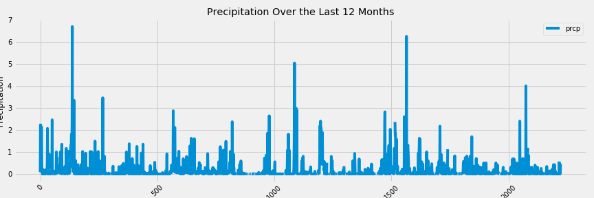
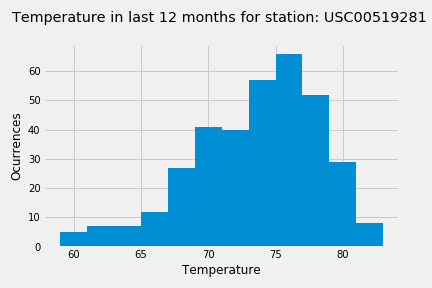
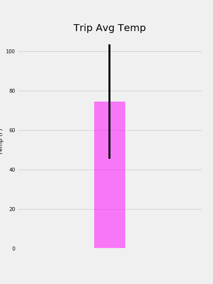

# Data analysis powered by:     
## SQLAlchemy ORM queries, Pandas, and Matplotlib.

## Authors 
* Daniel Cespedes - [LinkedIn](https://www.linkedin.com/in/selinzorob/) - [GitHub](https://github.com/danielczz)

## Project Outline

Surfs Up! In todays analysis we are going to use to sqllite provided data in order to provide insights for better business decision.

We will be able to act quick on data. Using data analysis we are going to load data and provide a traoditional ETL (Extract, Transform & Load) process for the provided data. 

At the same time this is an analysis for an assigment related to Data Analytics Bootcamp. 

- Please review main SQL script for programming commands: 
[main Script](https://github.com/danielczz/HW_10-Analyzing_data_with_SQLLite_-_Python/blob/master/main.ipynb)

#### **1. Data gathering**
- Data we are currently using is: 

    * 1 sqllite Database 
    * 2 csv files
    
#### **2. Data cleaning**
- Data is most of it already clean. 
- Some exercises will be done to "fine-tune" some information in the Database. 

#### **3. Data analysis** 
- Using SQLAlchemy and Python commands we are generating most of the analysis.

## Step 1 - Climate Analysis and Exploration

### Precipitation Analysis

### Station Analysis

### Temperature Analysis

### Other Recommended Analysis

  * Calculate the rainfall per weather station using the previous year's matching dates.

## Step 2 - Climate App
Flask API based on the queries that you have just developed:

### Routes

* `/`

  * Home page.

  * List of all routes that are available.

* `/api/v1.0/precipitation`

  * Return a JSON list of `date` as the key and `prcp` as the value.

* `/api/v1.0/stations`

  * Return a JSON list of `stations` from the dataset.

* `/api/v1.0/tobs`
  * Return a JSON list of Temperature Observations (tobs) for the previous year.

* `/api/v1.0/START_DATE` and `/api/v1.0/<START_DATE>/<END_DATE>`

  * Return a JSON list of the minimum temperature, the average temperature, and the max temperature for a given start or start-end range.

